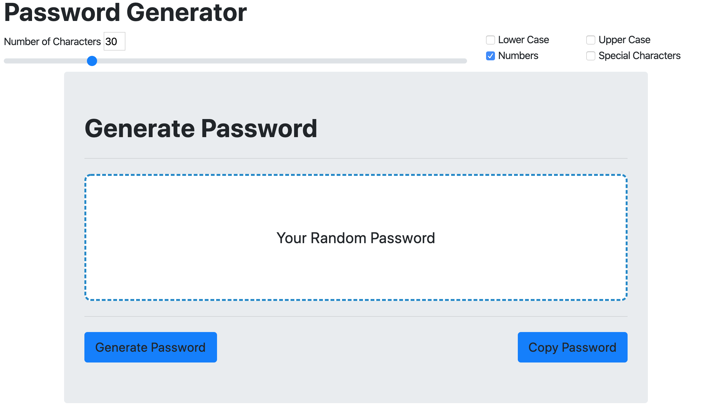

# HW3

This Random Password Generator takes the user input from the slide bar for number of characters and the checkboxes for the types of charcters the user wants in the password.
I made 4 arrays one for each of the diffrent character types. When the Generate Password button is clicked a function is run to see which check boxes are clicked then I had to write over 16 if eles statements for each of the diffrent combinations of true/false for the check boxes. There is probaly a better way to do that but I could not figure that out. The funtion then finds the if eles statement that is needed and combines the arrays of the corisponding selected characters. The function then does a loop and for however long the value of the character slide bar is. The loop randomyly selects a character from the new bigger array and adds it to a diffrent array. This new array is then joined with no spaces and posted to the p in the html.

Format: 
